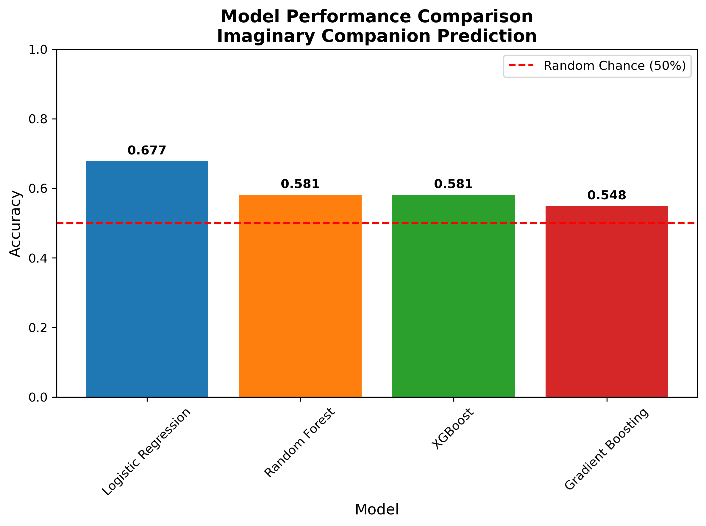
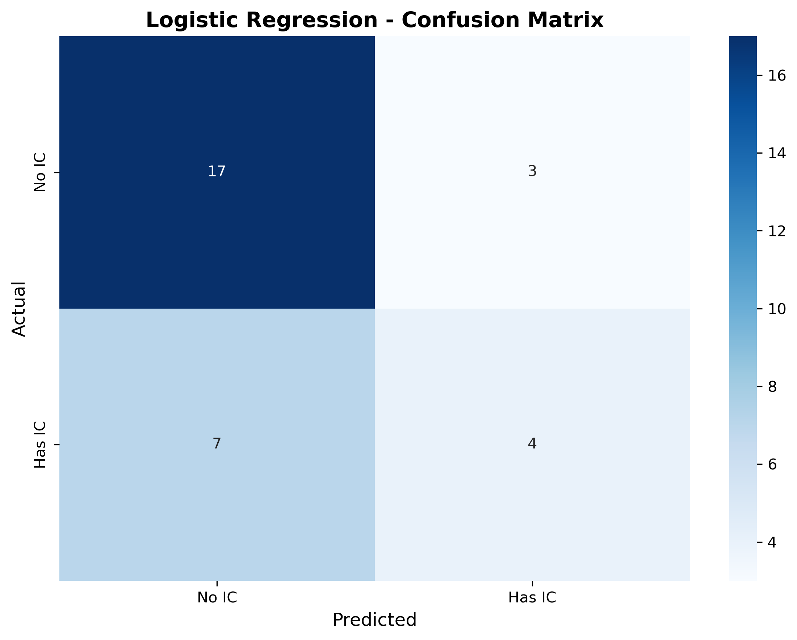
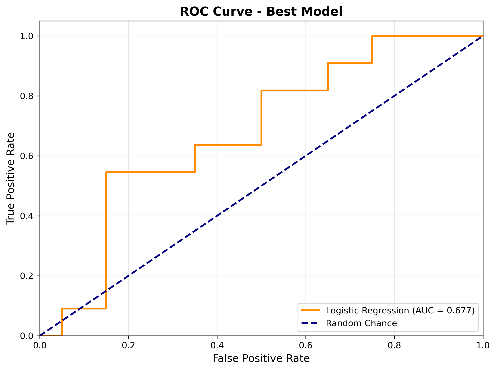

# Imaginary Companion Prediction Model

## 📌 Project Overview
This repository contains a comprehensive, end-to-end Machine Learning classification framework designed to predict whether an individual has an **Imaginary Companion (IC)** based on self-reported psychological health scores. The model analyzes core psychological metrics alongside demographic data to identify patterns that may indicate imaginary companion presence.

**Author:** Jeet Sarkar  
**Date:** June 4, 2026  
**Status:** Completed - First ML Project

##  Dataset Profile
The underlying dataset was sourced from empirical research hosted on the [OSF Search](https://osf.io/search). 

### Why This Matters
Imaginary companions are more than childhood fantasy - they provide insights into:
- **Social development patterns** and coping mechanisms
- **Early indicators** for psychological support needs
- **Creativity and emotional intelligence** markers
- **Loneliness management** strategies across age groups

### Potential Stakeholders
- Child psychologists and developmental researchers
- Educational institutions (early intervention programs)
- Mental health professionals
- Parents and caregivers

### The Question This Answers
> *"Can we predict if someone has an imaginary companion using only their psychological assessment scores?"*

### Psychometric Feature Dictionary:
* `loneliness`: Loneliness Index (higher score indicates deeper isolation).
* `affectional`: Perceived level of affectional/emotional social support systems.
* `instrumental`: Tangible or operational social support mechanisms.
* `tire`: Chronic fatigue or persistent physical/mental exhaustion indicator.
* `autonomy`: Measure of internal self-governance and individual independence.
* `depression`: Clinical tracking score mapping depressive symptoms.
* `anxity`: Clinical tracking score mapping generalized anxiety.
* `stress`: Quantified score determining baseline stress levels.
* `robotInteraction`: Level of attachment/engagement metrics with artificial or non-human agents.

*Note: Demographics (`age`, `gender`) were cleaned and integrated via preprocessing workflows.*

## ⚙️ Workflow Architecture
The workflow transitions seamlessly across critical stages of a data science pipeline:
1.  **Exploratory Data Analysis (EDA):** Assessing value distributions, profiles, and structural properties.
2.  **Data Imputation & Preprocessing:** * Categorical feature mapping using mode imputation (`gender`).
    * Symmetric numerical features imputed via mean tracking; skewed variables containing extreme outliers (`stress`) handled via robust median calculations.
    * One-Hot Encoding executed over categorical variables.
3.  **Feature Normalization:** Training data metrics learned and transferred onto test splits via `StandardScaler` to maximize stability across distance-based algorithms.
4.  **Hyperparameter Optimization:** Automated grid search tuning (`GridSearchCV`) paired with dynamic multi-step stochastic evaluation (`RandomizedSearchCV`).
5.  **Performance Evaluation:** Validated using multi-class accuracy metrics, ROC/AUC space monitoring, and Confusion Matrices.

## 🧪 Experimental Framework & Results
Four separate machine learning algorithms were benchmarked across stratified data splits to maintain robust evaluation targets.

| Classifier Model | CV Score Validation | Test Split Accuracy |
| :--- | :---: | :---: |
| **Logistic Regression (Winner)** | **0.636** | **67.7% (0.677)** |
| Random Forest Classifier | 0.683 | 58.1% (0.581) |
| XGBoost Classifier | 0.700 | 58.1% (0.581) |
| Gradient Boosting Classifier | 0.667 | 54.8% (0.548) |

### Performance Visualizations
Below are the key plots produced by the data pipeline, showcasing model performance metrics:

#### Model Accuracy Benchmark

#### Confusion Matrix (Logistic Regression)

#### ROC-AUC Analysis

